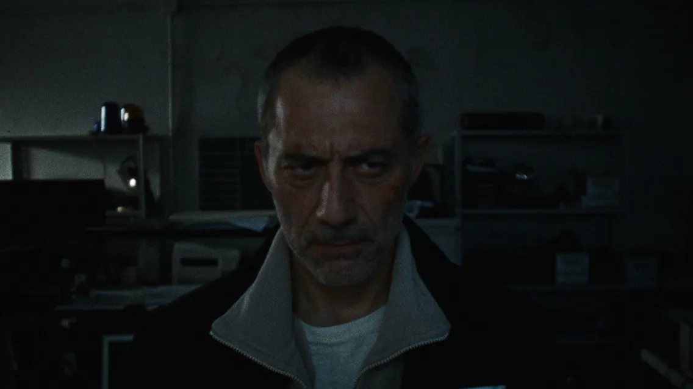

---
tags:
  - MOVIE
  - SERIES
author: 'Valerio Narcisi'
cover: https://www.taxidrivers.it/wp-content/uploads/2024/05/Dostoevskij-poster-serie-Think-Movies.jpg
coverAuthor: taxidrivers.it
coverLinkSource: https://www.taxidrivers.it/
createdAt: 'July 16, 2024'
description: 'Ovvero come la dedizione per una passione ci fa diventare altro e forse proprio quello che desideriamo'
isDraft: 'No'
language: 'it'
title: 'Dostoevskij dei Fratelli D’Inncenzo'
---

Dostoevskij si apre con Enzo ([Filippo Timi](https://letterboxd.com/actor/filippo-timi/)) steso sul pavimento della casa. È immobile, sorride e piange mentre guarda il soffitto.

In questa presentazione del personaggio di Enzo abbiamo tutto quello che fino a quel punto è il protagonista. Un uomo alla fine della sua storia. Immobile che sta aspettando la fine e questa attesa è un’attesa impaziente, gioiosa, commovente.

Stacco e abbiamo Enzo che vomita, un vomito vero e non finto con gli spasmi e rutti che anticipano il conato che sono veri e vicini a noi, sentiamo le dita di Enzo nella nostra gola.

> Inizia così il film, perché questo è Dostoevskij, un film molto lungo.

Nella prima parte il protagonista è un passivo, in pratica non fa nulla per avvicinarsi all’assassiono se non leggere morbosamente le lettere che lascia ogni volta dopo un delitto. Lettere scritte bene, con forza e passione.

La prima parte è incentrata sul rapporto con la figlia Ambra, interpretata da [Carlotta Gamba](https://letterboxd.com/actor/carlotta-gamba/). I due sono due derelitti che vivono tra i relitti. La camera li segue senza mai trovare l’appiglio di un cavalletto. Noi siamo con loro, noi siamo loro. È un romanzo Dostoevskij scritto in prima persona.

La prima parte ricorda molto, come stile narrativo, Beau is Afraid a mio avviso, dove tutto quello che succede succede all’esterno del personaggio principale. Enzo è immobile e si muove perché è costretto dagli altri personaggi che lo tirano e lo forzano a fare quel poco che fa.

In questa prima parte ho sofferto le battute, come sono scritte come sono interpretate, ma ne scriverò nel finale di questo post.

Il mondo lavorativo di Enzo è formato da gang di poliziotti che si sfidano alla ricerca un assassino che è troppo per loro, per la loro provincialità.

Nella seconda parte, dopo che Enzo avrà lasciato la polizia, la narrazione prende un velocità inaspettata.

> Parlerò del finale quindi mollate qui la lettura.

Enzo lascia la polizia perché tradito. Vende casa nel tentativo suicida di mettere la figlia nella condizione di non farsi troppo del male, anche se continuerà a farselo.

Confiderà alla figlia la sua essenza, tutti i suoi perché. Perché fa uso di pastiche e perché se ne è andato abbandondandala quando era piccola in una scena poetica e straziante.

Continuerà a seguire la sua traccia tra mummie e strani personaggi che vivono come topi sulla scia che lui pensi che sia giusta e valida.

Sistemata a suo modo lo figlia inizia il vero inseguimento.

> Enzo non gioca più, senza compromessi cerca di risolvere il caso, di seguire la sua passione: ed è qui il cuore del film. Quanto siamo disposti ad essere radicali nelle cose che desideriamo, che ci interessano, che ci fanno stare bene fino a che siamo in vita? Quanto siamo disposti a rischiare per trovare noi stessi? E trovarci significa inevitabilmente perderci.

Una volta trovato Dostoevskij, che è una donna, in una scena bellissima dove nulla è chiaro ma si capisce tutto. Dove il thriller si mischia con l’horror fino allo splatter. Tra velocissime carrollete nella campagna sotto la luce di pickup scassato e sparatorie, Enzo arriverà a minacciare Dostoevskij di non farlo morire.

> Enzo usa la vita come minaccia, una vita noiosa chiusa in una cella quando Dostoevskij desidera di farla finita perché sente che la sua storia è termianta.

E qui succede quello che doveva succedere. Avvine la trasformazione e grazie alla parola scritta Enzo eredita Dostoevskij. Dostoevskij è vivo, è mutato e continuerà ad esistere.

Qui mi ricollego alla parola scritta e parlata per chiudere.

> La parola scritta dell’assassino è bella, conturbante, profonda dove ci specchiamo e non vogliamo che si esaurisca mai. Quella detta, pronunciata, da tutti i personaggi in Dostoevskij è grottesca al limite del brutto, è buona per un libro ma non per un film.
>
> I personaggi parlano male, fa strano, ma nella seconda parte del film questa stranezza si fa meno sentire per l'incedere che ha la storia. Non è un erroe, la cosa è voluta perché la parola detta è brutta, quella scitta è bella, è salvifica, ha senso.

I Fratelli D'Inncenzo sono riusciti nel portare il thriller alla [Memories of Murder](https://letterboxd.com/film/memories-of-murder/), alla True Detective, in Italia, con una scommessa fatta tra loro e Sky. Come fa Enzo con l'indagine, allin senza pensarci troppo.

Sicuramente Dostoevskij è una delle cose più interessanti uscite fino a questo momento, non solo in Italia, nel 2024.
