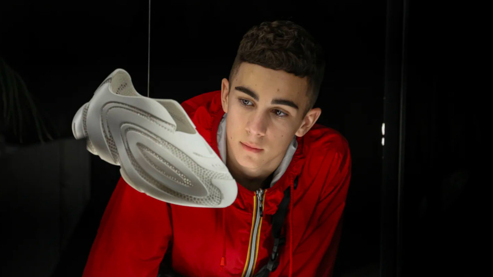
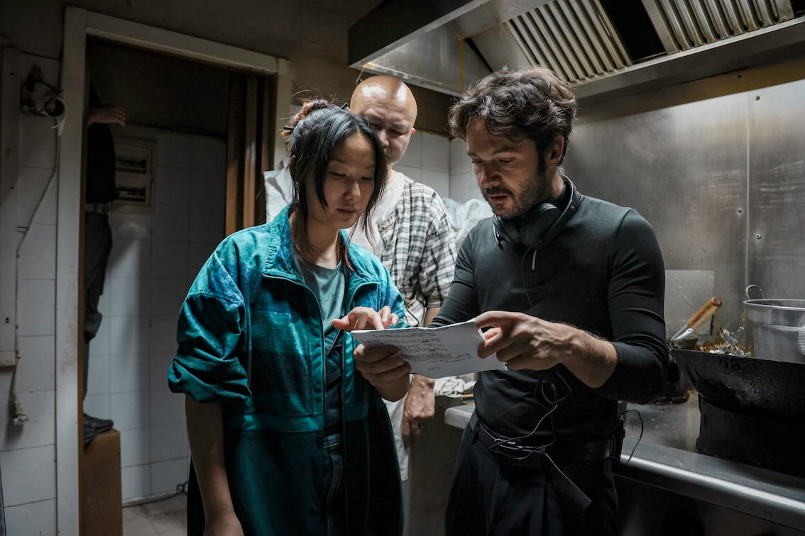
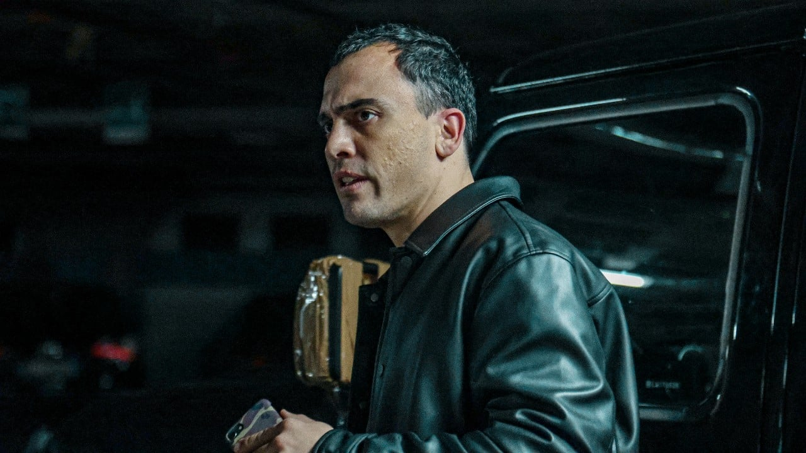

Film d’esordio di Luigi di Capua e presentato a Torino Film Festival 2023 (non in concorso)

Il film di Di Capua risulta essere interessante anche se ha i suoi difetti a mio avviso.

Le quattro storie che si avvitano attorno alle Typo 3, una mitologica scarpa dalla dubbia estetica, si uniscono nel finale dando un po' il senso a quello che abbiamo visto.

## Trascendere gli oggetti

La volontà di raccontare il rapporto che c’è tra gli uomioni e le cose, in questo caso una scarpa, e chi scrive vive in una zona dove si campa facendo le scarpe (sigh), è molto interessate. C’è chi usa la Typo 3 per raggiungere un obiettivo sentimentale in maniera infantile. C'è chi le usa per la sua scalata e accettazione sociale. C'è chi le usa (non le Typo 3) per scopa’.

Trascendere il significato di un oggetto fino a farlo diventare la leva per il raggiungimento di qualcosa di più elevato come il riconoscimento personale (e quindi essere riconosciuti dagli altri) è una delle cose più umane che ci siano. Penso anche alle relegioni e alla loro ritualità intorno ad oggetti che trascendono, che cambiano significato. Il film riesce nell’intento di farci vedere questi personaggi sempre patetici con occhio mai giudicante, anzi, ha il merito di farceli sentire vicini e mai alieni.

L’unico problema del film a mio avviso, che a me è mediamente piaciuto, sono le ridodanze. 

La volontà di Di Capua di voler raccontare tutto, ogni sfaccettatura, ogni micro increspatura che c’è nel rapporto uomo-scarpa-altro fa diventare il racconto poco fluido.

## Bibbolino, quello che è riuscito meglio.

Non tutte le quattro storie sono riuscitissime. La migliore senza dubbio è quella di Bibbolino interpretato da [Simone Liberati](https://letterboxd.com/actor/simone-liberati/) che fa un po’ da colonna portante del film.

Bibbolino con le sue umiliazioni continue, con il suo vestire infantile, con il suo lavoro *che sta ingrandando*, con il suo rapporto subalterno con il padre, con il suo tentativo di creare un contatto con il figlio tramite le Typo 3, con i suoi tentativi mai riusciti e sempre *vorrei ma non posso* di svicolarsi dal rapporto con il padre, lo rende sicuramente il personaggio più umano e quindi complesso.

Di Capua in questa storia fa sentire che sa esattamente di cosa stia raccontando. Di quell'eredità che schiaccia e soffoca. Quell'eredità che ti permettere di fare una vita al di sopra delle tue possibiltà. Che permette l'inseguimento di un sogno ma che al tempo stesso ha un prezzo da pagare, inferiore certamente di chi questa eredità non ce l'ha, ma porta comunque con sé un effetto collatarale.
La dedizione di Bibbino per le scarpe, finanziata dal padre, è il punto e la cosa che a me è piaciuta di più, anche se solo sfiorata. 

Ovviamente il film avrebbe dovuto parlare d'altro ma a me ha colpito molto questo aspetto.

> Forse, anzi senza *forse*, questo è un po' il tema di una generazione cresciuta nell'abbondanza e nella possibiltà di non lavorare fino ai trentacinque anni.

La regia indugia sempre molto sui volti, è sempre molto in prossimità. Le musiche belle ma un po’ troppo invasive a mio avviso.

Holy Shoes è una favola nera scritta su quattro protagonisti che non cambiano mai durante la storia. I loro difetti, subito presentati e mai sanati, faranno si che la posta in gioco diventi sempre più alta fino alla distruzione e tutto questo con ai piedi le Typo 3.

