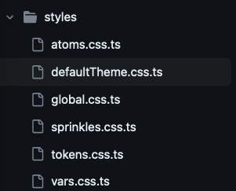
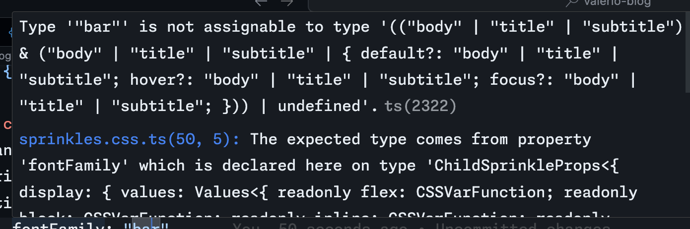
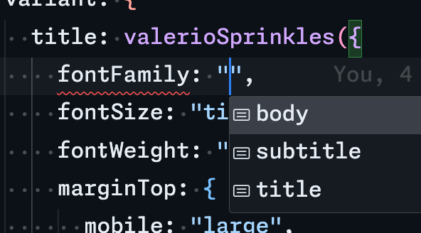
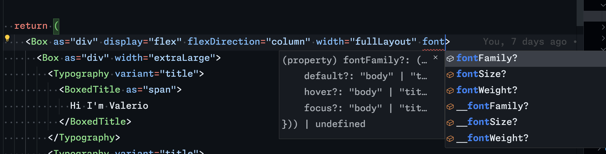

A few months ago I heard about a way to write typed CSS using TypeScript. The idea is amazing and inspired me to try a different way of writing CSS.

In my web development journey I wrote a lot of css, sass/scss and in many of my projects I used styled-component to write my components.

Styled solved the problem with locally scoped classes and variables, but we know very well the side effect of using it in large applications.

So when I was faced with the idea of building my own site, I thought Vanilla-Extract was a good idea to try a different way to write more self-explanatory CSS.

## **What is vanilla-extract?**

> Zero-runtime Stylesheets in TypeScript. Use TypeScript as your preprocessor. Write type-safe, locally scoped classes, variables and themes, then generate static CSS files at build time.
> 

All the styles generated by vanilla-extract is at build time.

You can write a global theme or create your theme.

It is framework agnostinc and you can create your extentions using: Sprinkles, Recipes and Dessert Box.

## **Creating typed theme**

First of all, i got some inspiration from Bento design system and i wanted to try Astro with React (because I had started building my blog with Next.js)

[https://github.com/buildo/bento-design-system/tree/main/packages/bento-design-system](https://github.com/buildo/bento-design-system/tree/main/packages/bento-design-system)

In my astro configuration i added the related vanilla extract plugin:

```jsx
//astro.config.mjs

import { defineConfig } from "astro/config";
import { vanillaExtractPlugin } from "@vanilla-extract/vite-plugin";
import react from "@astrojs/react";
import netlify from "@astrojs/netlify";

import sitemap from "@astrojs/sitemap";

// https://astro.build/config
export default defineConfig({
  // Enable React to support React JSX components.
  integrations: [react(), sitemap()],
  prefetch: true,
  output: "server",
  adapter: netlify(),
  vite: {
    plugins: [vanillaExtractPlugin()]
  }
});
```

I have structured my code in this way.



I have created a default theme

```jsx
import { createTheme } from "@vanilla-extract/css";
import { tokens } from "./tokens.css";
import { vars } from "./vars.css";

// @ts-ignore
export const defaultTheme = createTheme(vars, tokens);
```

and after that i used my theme in a Layout component.

Doing this i will create others theme and inject them at this level.

```jsx

...
const Layout: FC<Props> = ({ children, pathname, seo }) => {

  const currentYear = new Date().getFullYear();

  return (
    <html lang="en" className={clsx(defaultTheme)}>
    ...
```

After that i started to write my utilities.

The good thing about Vanilla-Extract is the mental model shift it 
requires. Vanilla is utility first and it means that you have to write 
your utility like Tailwind.

For example you want to add the fontFamily:

- go in vars.css.ts and create your global contract. It is similar ot an interface.

```jsx
//src/styles/vars.css.ts
export const vars = createGlobalThemeContract(
  {
    fontFamily: {
      body: null,
      title: null,
      subtitle: null,
    },

   ...

```

- go in tokens.css.ts and write what is fontFamily.body is

```jsx
//src/styles/tokens.css.ts
...
export const tokens = {
...
  fontFamily: {
    body: `'Merriweather', sans-serif;`,
    title: `'Staatliches', sans-serif`,
    subtitle: `'Merriweather', sans- serif;`,
  },
  ...
}  as const

```

- go in atoms.css.ts and declare the related atom

```jsx
// src/styles/atoms.css.ts
export const fontFamilyProps = {
  ...vars.fontFamily,
} as const;

```

- go in sprinkles.css.ts and define your props

```jsx
// src/styles/sprinkles.css.ts

const typographyStyles = defineProperties({
  properties: {
    fontFamily: fontFamilyProps,
    fontSize: fontSizeProps,
    fontWeight: fontWeightProps,
    letterSpacing: letterSpacingProps,
    textAlign: textAlignProps,
  },
});

...
export const valerioSprinkles = createSprinkles(
  ...
  typographyStyles,
  ...
);

export type ValerioSprinkles = Parameters<typeof valerioSprinkles>[0];
```

Congrats! You wrote the your first sprinkes. Now go ahead and use it into a react component.

It is simple. Create a component like Typography.tsx with realated 
*.css.ts file and use valerioSprinkles to use our utilities. In this 
example i used recipe, a lib linked to vanilla extract to create 
variants and conditions

[https://vanilla-extract.style/documentation/packages/recipes/](https://vanilla-extract.style/documentation/packages/recipes/)

```jsx
//src/components/Typography/Typography.css.ts
      title: valerioSprinkles({
        fontFamily: "title",
        fontSize: "title",
        fontWeight: "800",
        marginTop: {
          mobile: "large",
          tablet: "large",
          desktop: "large",
        },
        color: "neutral",
      }),

```

and if i try to write 

`fontFamily:"bar"`

 i got an error both compiler and vs code.



At the same time the vs code intellisense give me all the suggestion that i declared before



Now you can use it directly in your react component

```jsx
// src/components/Typography/Typography.tsx
const Typography: FC<TypographyProps> = ({ variant, children }) => {
  return (
    <Box as={variantAs[variant || "span"]} className={typographyRecipe({ variant: variant || "body" })}>
      {children}
    </Box>
  );
};

```

As you can see i’m using Box. Box is an anamorphic component that give to use the fully control of the all our atoms.

[https://github.com/TheMightyPenguin/dessert-box](https://github.com/TheMightyPenguin/dessert-box)

After installing it you can create your Box component

```jsx
import { createBox } from "@dessert-box/react";
import { valerioSprinkles } from "../../styles/sprinkles.css";

const Box = createBox({ atoms: valerioSprinkles });

export default Box;

```

Now you can use box where you want and you can access directly at all the atoms declared.



In my opinion, it's really useful for quick styling.

## Final thoughts

### PRO:

- typed css
- get speed with <Box />
- sprinkles conditions are really useful to create breakpoint and all you need
- recipe permits to create more readable css code without if
- no js, only css in the browser

### CONS:

- you have to use globalStyles to write nested css

```jsx
globalStyle(`  ${postBodyStyle} > p > img.alignright`, {
  float: "right",
  marginLeft: vars.space.large,
  marginTop: vars.space.large,
  marginBottom: vars.space.large,
});

```

- at the beginning is a bit frustrating redeclare all css rules but at the medium/long term you go really fast.

If you want go in my repo and see how i used vanilla-extract

[https://github.com/valerionarcisi/valerio-blog](https://github.com/valerionarcisi/valerio-blog)